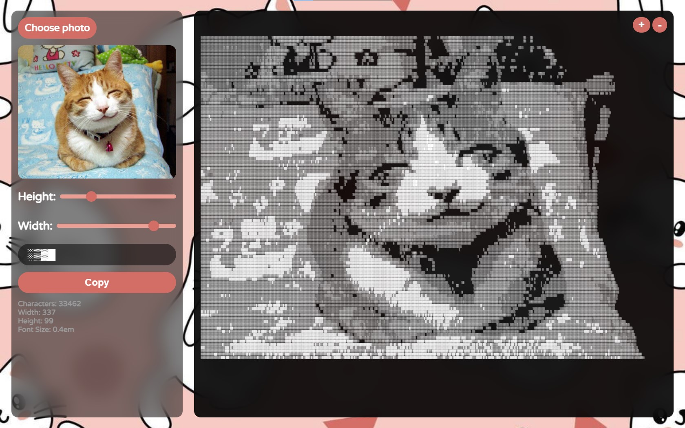
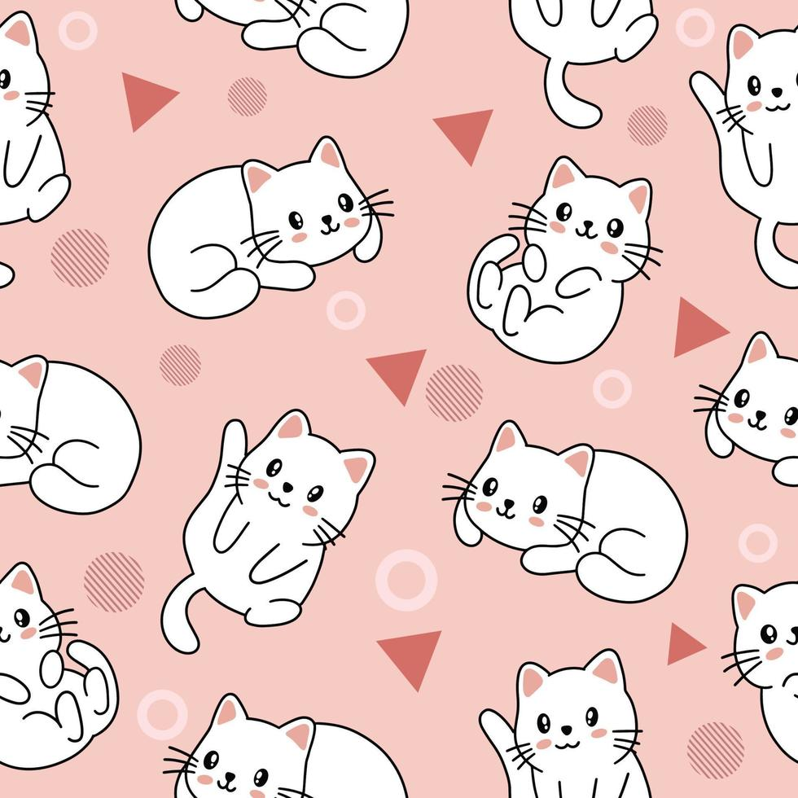

# Welcome to Kawacii!🌟

Turn your photos into stunning ASCII art with Kawacii, the most awesome converter out there! 😍

  

## Background

I had some images that I wanted to convert into ASCII art, but I couldn't find a decent converter on the market. Some were too basic, others were too clunky, and many had too many ads or were overly limiting. So, I decided to create my own!

## Features

- **Beautiful UI**: Enjoy a visually pleasing interface. 🎨

- **Responsive Design**: Use Kawacii seamlessly across all devices. 📱

- **Best in Class**: Kawacii is superior to ANY other converter on the market! 🏆

- **Lightning Fast**: Experience blazing-fast image conversion. ⚡

- **Custom Dimensions**: Set your desired height and width for the ASCII output. 🖼️

- **No Brightness Threshold**: No need to worry about image brightness. 🌞

- **Gradient Output**: Kawacii provides gradient ASCII art based on pixel brightness. 🌈

- **Light and Dark Themes**: Automatically switches between themes based on your preference. 🌓

- **Custom Characters**: Customize ASCII output with your favorite characters. 🔤

- **Supports Multiple Formats**: Convert images in various formats with ease. 🔄

  

## How to Use

1. **Upload Image**: Select your image using Kawacii's easy-to-use interface. 📤

2. **Adjust Settings**: Customize dimensions and characters to your liking. ⚙️

3. **Convert**: The image is converted automatically as you adjust the settings! 🎉

4. **Copy and Share**: Copy your ASCII masterpiece and share it with your friends! 💬

**Note**: When specifying custom characters, begin with a whitespace character for proper alignment. Arrange the characters in ascending order of weight without any spaces between them. For example: `.~$#` (please include " " at the beginning).

Open Kawacii in your browser and start creating adorable ASCII art today! 🖼️✨

## Credits

Kawacii was lovingly crafted by [ShazamBolt8](https://github.com/ShazamBolt8) with passion and kawaii vibes. ❤️🌟

This project is licensed under the [MIT License](LICENSE). Feel free to use it and contribute. Proper credit will be appreciated! 📝👍

